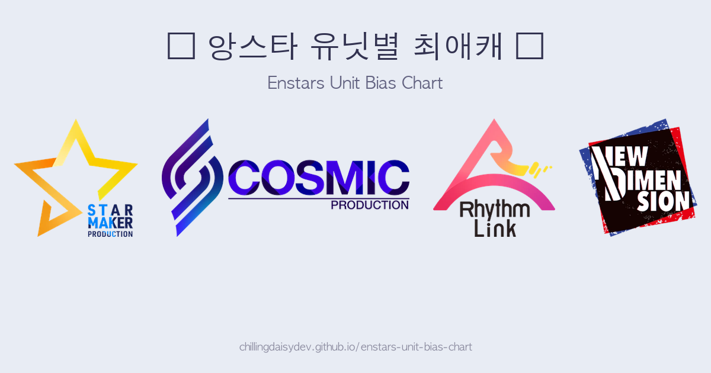

# ⭐ 앙스타 유닛별 최애캐 고르기 | Enstars Unit Bias Chart

앙상블 스타즈(Ensemble Stars!!) 유닛별로 최애 캐릭터를 골라보세요!

👉 **[지금 해보기](https://chillingdaisydev.github.io/enstars-unit-bias-chart/)**

## 기능

- 🎯 **유닛별 최애캐 선택** — 16개 유닛 + 기타 캐릭터
- 🖼️ **이미지 저장** — 선택 결과를 PNG로 저장
- 🔗 **링크 공유** — URL로 선택 결과 공유
- 🌏 **다국어 지원** — 한국어 / 日本語 / English (브라우저 설정 자동 감지)
- 📱 **PWA** — 홈 화면에 앱으로 추가 가능

## 소속사 & 유닛

| 소속사 | 유닛 |
|--------|------|
| Starmaker Production | fine, Trickstar, 流星隊, ALKALOID |
| Cosmic Production | Eden, Valkyrie, 2wink, Crazy:B |
| Rhythm Link | UNDEAD, Ra*bits, 紅月, Melodious |
| New Dimension | Knights, Switch, MaM, ESPRIT |
| 기타 | 사가미 진, 쿠누기 아키오미, 나이스, 토죠 카나메, 쿠로네 히츠기(네기), 히다카 세이야, 게이트 키퍼, 안즈 |

## 스크린샷

## Disclaimer

이 프로젝트는 **비영리 팬 프로젝트**입니다. 오로지 재미를 위해 만들었으며, 상업적 목적이 전혀 없습니다.

Ensemble Stars!! 및 관련 캐릭터, 이미지의 저작권은 Happy Elements에 있습니다.

This is a **non-commercial fan project** made purely for fun. All rights to Ensemble Stars!! and related characters/images belong to Happy Elements.

---

Made with ☕ and ❤️
